Creamos las máquinas 

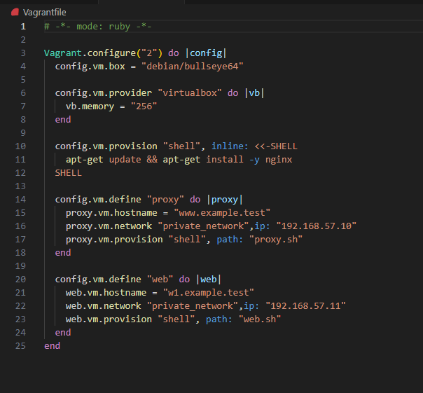

Modificamos el archivo de configuración del sitio web 

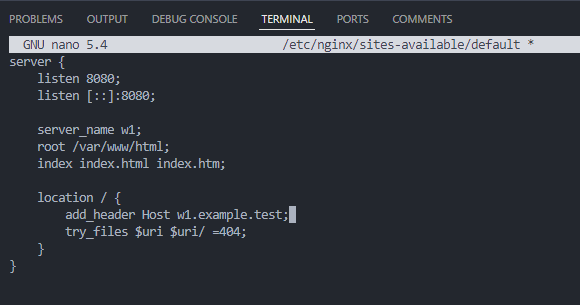

Reiniciamos Nginx para aplicar los cambios 

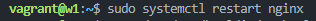

Creamos una página de prueba en /var/www/html

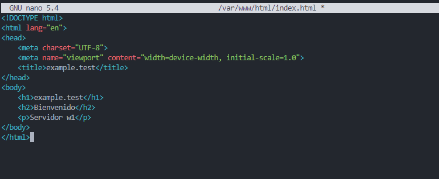

Instalamos curl y comprobamos que funciona 

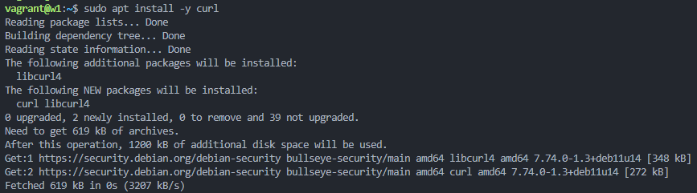

Añadimos la dirección IP del servidor web "w1" al fichero hosts de 'proxy' 

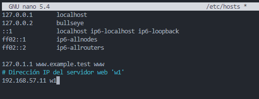

Modificamos el archivo de configuración de proxy 

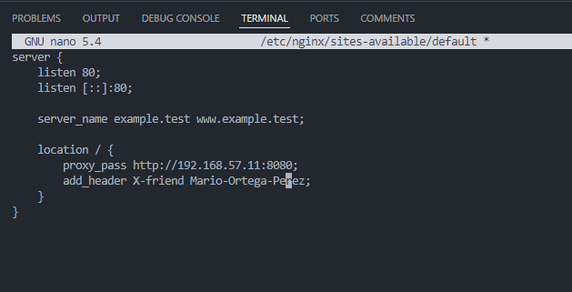

Reiniciamos el servidor 

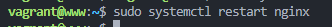

Añadimos al hosts de la máquina anftriona 

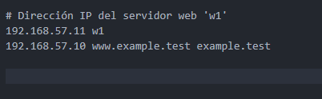

Accedemos a las url 

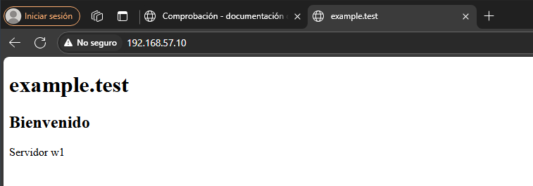
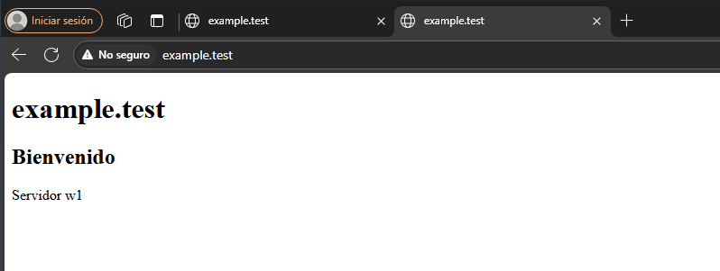
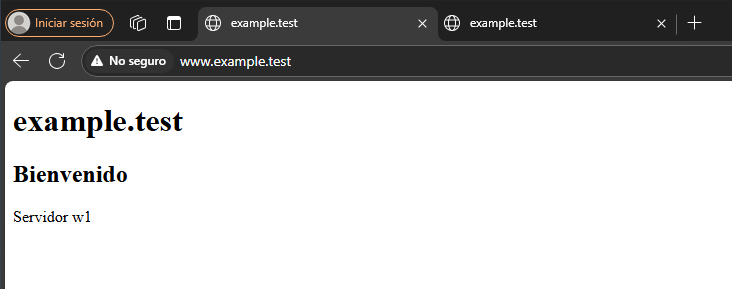

##  Comprobación

Accedemos a la IP 192.168.57.10

Accedemos a los logs de 'proxy'

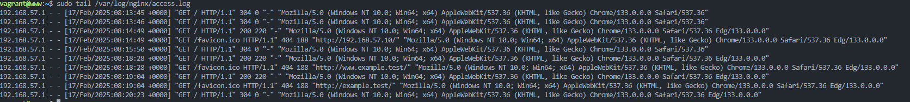

Accedemos a los logs de 'web' 

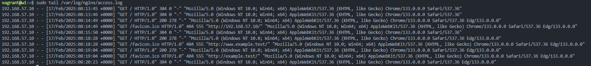

## Cabeceras

### Cabeceras en proxy

Antes de la modificación 

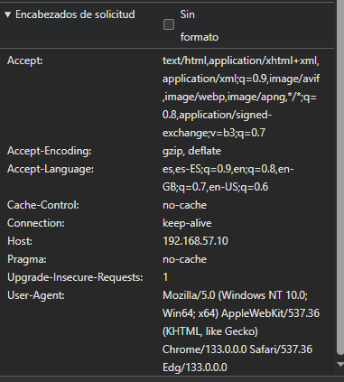

Añadimos X-friend en el bloque location del archivo de configuración de proxy 

Reiniciamos el servidor 

Volvemos a acceder a la web y comprobamos 

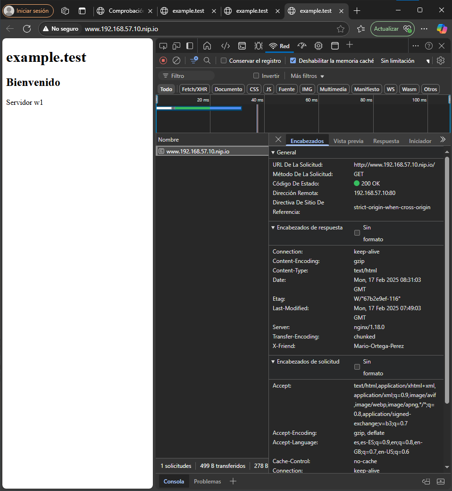

### Cabeceras en web 

Añadimos add_header en el bloque location del archivo de configuración de web 

Reiniciamos el servidor 

Volvemos a acceder a la web y comprobamos 

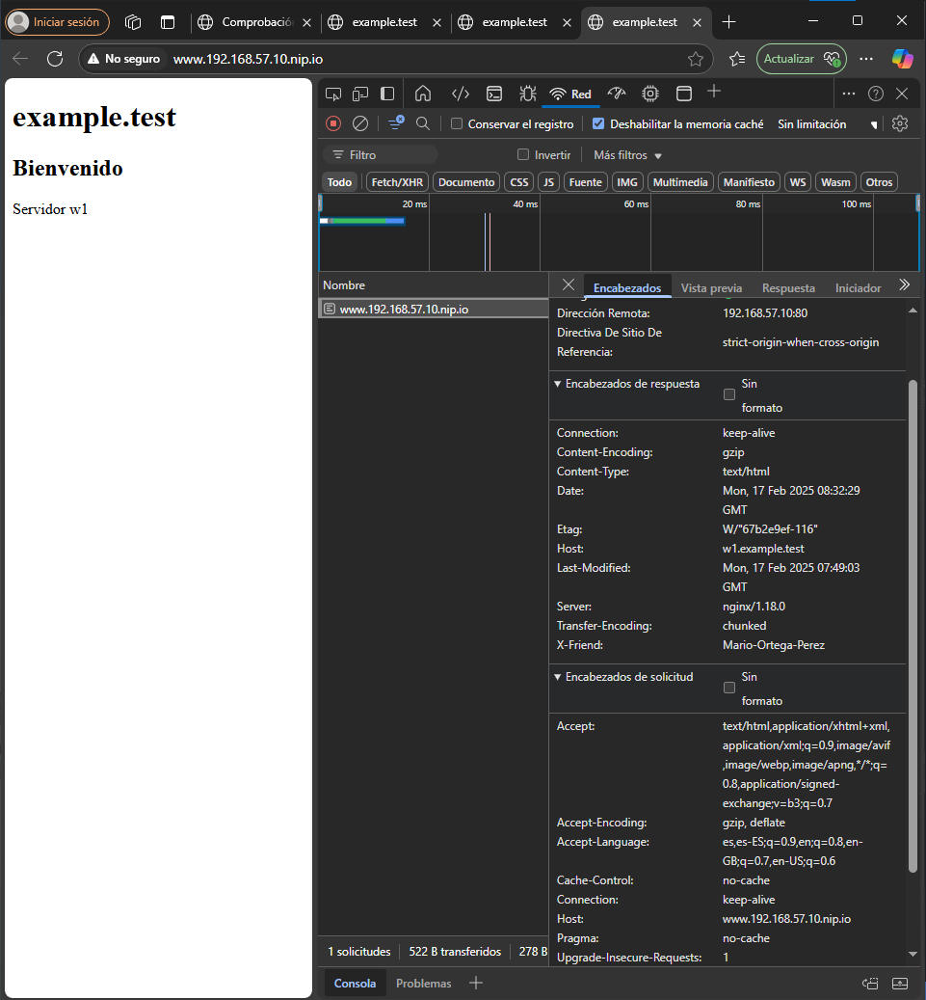

## Docker  

Creamos el archivo .yml 

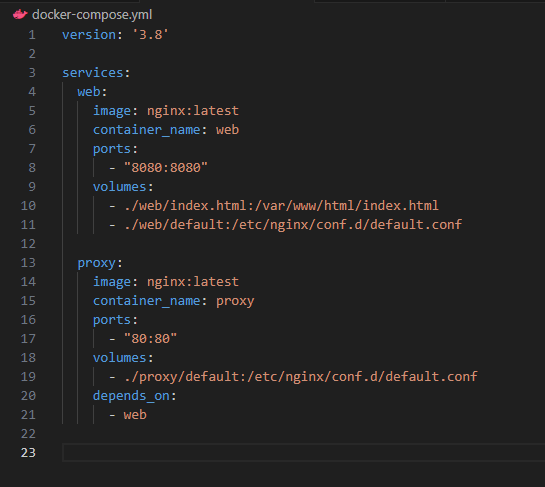

Hacemos el docker-compose up 

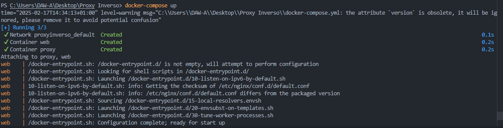

Verificamos que está corriendo 

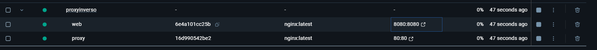

Comprobamos que funciona

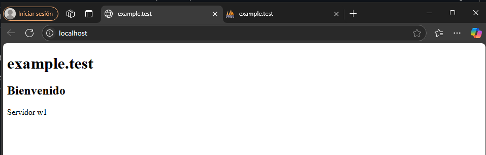
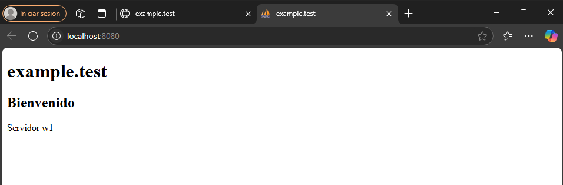

